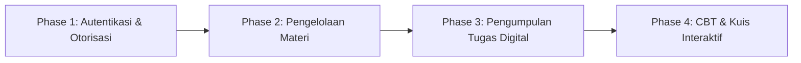
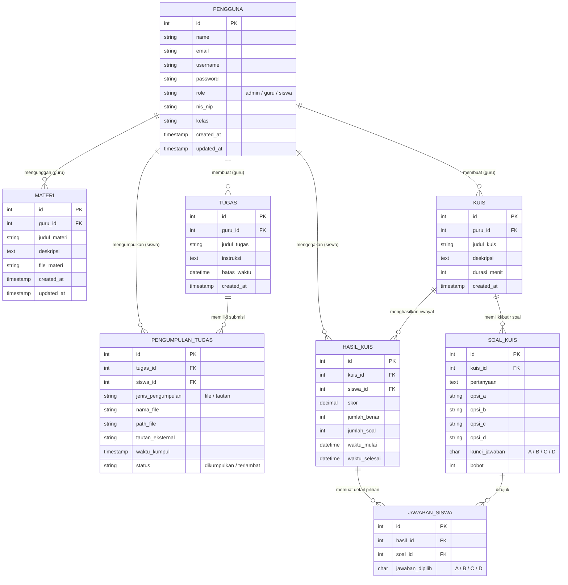
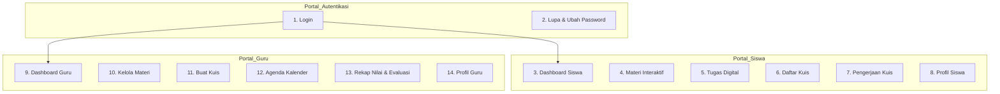

# DOKUMENTASI PROYEK PENGEMBANGAN SISTEM
# Platform Pembelajaran & CBT Bahasa Inggris Kelas XI SMK
**Aplikasi:** EngLearn CBT  
**Penyusun:** Khansa Sayyidah Safitri  
**Desain Figma:** [Figma Design Canvas](https://www.figma.com/design/cWWfKeejJgPMJ1K8qoPxDU/EngLearn-CBT-WK?node-id=1001-4&p=f&t=P1o9yZpxxyHylhuQ-0)  
**Repositori GitHub:** [khansa113/cbt-eng](https://github.com/khansa113/cbt-eng)  

---

## 1. Highlight & Ringkasan Eksekutif

> [!NOTE]  
> Guru dan siswa dapat mengakses materi pembelajaran Bahasa Inggris SMK Kelas XI, mengumpulkan tugas secara digital melalui berbagai format file, serta mengerjakan kuis evaluasi secara daring, sehingga proses belajar mengajar dan penilaian berlangsung lebih interaktif, fleksibel, serta terorganisir secara otomatis.

---

## 2. Background and Problem Statement

Dalam proses belajar mengajar Bahasa Inggris di tingkat SMK, siswa seringkali membutuhkan akses materi yang terstruktur, media pengumpulan tugas yang praktis, serta sarana latihan yang dapat diakses kapan saja. 

Di sisi lain, guru kerap menghadapi kendala dalam:
1. Mendokumentasikan tugas siswa secara manual yang rentan tercecer.
2. Mengelola materi pembelajaran multisubjek (teks, audio listening, modul speaking).
3. Melakukan koreksi evaluasi soal pilihan ganda secara manual yang memakan waktu lama.

### Solusi Sistem
Platform Website Pembelajaran Bahasa Inggris (*EngLearn CBT*) ini hadir sebagai solusi terpadu dengan 5 pilar fungsionalitas:
* 🔐 **Autentikasi Berjenjang:** Login dan Register terpisah untuk Guru dan Siswa.
* 📚 **Manajemen Materi:** Pengelolaan modul Bahasa Inggris Kelas XI terintegrasi file dokumen & audio.
* 📤 **Pengumpulan Tugas Digital:** Pengumpulan via unggah file (PDF/dokumen) maupun tautan eksternal (Google Drive).
* 📝 **Evaluasi Kuis Interaktif:** Pengerjaan soal interaktif dengan timer, kunci layar, dan rekapitulasi nilai instan.
* 📊 **Rekapitulasi & Riwayat:** Laporan nilai kuis otomatis dan riwayat pengumpulan tugas siswa.

---

## 3. Objective & Tahapan Rencana Pengembangan



* **Phase 1 (Autentikasi & Hak Akses):**  
  Pengaturan Login dan Register untuk Guru dan Siswa, pengelolaan hak akses (*Role Permission*: Admin, Guru, Siswa), fitur ubah password, dan logout.
* **Phase 2 (Manajemen Materi Pelajaran):**  
  Pengelolaan materi pembelajaran Bahasa Inggris Kelas XI SMK (menambah, menampilkan, memodifikasi modul PDF dan audio listening).
* **Phase 3 (Sistem Tugas & Penilaian):**  
  Fasilitas pengumpulan tugas siswa via file dokumen atau link Google Drive, dilengkapi rekapitulasi pengumpulan dan koreksi berumpan balik (*feedback*) bagi guru.
* **Phase 4 (CBT / Kuis Interaktif Otomatis):**  
  Pembuatan bank soal, pengaturan batas waktu (*timer*), sistem pengerjaan siswa, serta penilaian dan kalkulasi skor otomatis.

---

## 4. Technical Architecture: Entity Relationship Diagram (ERD)



---

## 5. Spesifikasi Kamus Data (Data Dictionary)

| Nama Tabel | Atribut / Kolom | Tipe Data & Constraint | Keterangan & Aturan Form |
| :--- | :--- | :--- | :--- |
| **1. pengguna** | `id` | `INT` (Auto Increment, PK) | Identitas unik user |
| | `name` | `VARCHAR(255)` | Nama lengkap pengguna |
| | `email` | `VARCHAR(255)` (Unique) | Email unik satu akun |
| | `username` | `VARCHAR(8)` (Unique) | Min 4, Max 8 karakter |
| | `password` | `VARCHAR(255)` (Hashed) | Min 8, Max 15 karakter sebelum di-hash |
| | `role` | `ENUM('admin', 'guru', 'siswa')` | Peran hak akses |
| | `nis_nip` | `VARCHAR(50)` (Nullable) | Nomor Induk Siswa / Pegawai |
| | `kelas` | `VARCHAR(50)` (Nullable) | Khusus diisi untuk siswa |
| | `created_at` / `updated_at` | `TIMESTAMP` | Otomatis sistem |
| **2. materi** | `id` | `INT` (Auto Increment, PK) | ID Materi |
| | `guru_id` | `INT` (FK -> pengguna.id) | ID Guru pengunggah |
| | `judul_materi` | `VARCHAR(255)` | Judul materi |
| | `deskripsi` | `TEXT` (Nullable) | Uraian penjelasan |
| | `file_materi` | `VARCHAR(255)` (Nullable) | Path penyimpanan file |
| **3. tugas** | `id` | `INT` (Auto Increment, PK) | ID Tugas |
| | `guru_id` | `INT` (FK -> pengguna.id) | ID Guru pembuat |
| | `judul_tugas` | `VARCHAR(255)` | Judul penugasan |
| | `instruksi` | `TEXT` (Nullable) | Petunjuk pengerjaan |
| | `batas_waktu` | `DATETIME` (Nullable) | Waktu tenggat penugasan |
| **4. pengumpulan_tugas** | `id` | `INT` (Auto Increment, PK) | ID Submisi |
| | `tugas_id` | `INT` (FK -> tugas.id) | Referensi tugas |
| | `siswa_id` | `INT` (FK -> pengguna.id) | Siswa pengumpul |
| | `jenis_pengumpulan` | `ENUM('file', 'tautan')` | Metode pengumpulan |
| | `nama_file` / `path_file`| `VARCHAR(255)` (Nullable) | Diisi jika jenisnya file |
| | `tautan_eksternal` | `VARCHAR(255)` (Nullable) | Tautan Google Drive |
| | `waktu_kumpul` | `TIMESTAMP` | Otomatis tercatat |
| | `status` | `ENUM('dikumpulkan', 'terlambat')`| Otomatis oleh kalkulasi deadline |
| **5. kuis** | `id` | `INT` (Auto Increment, PK) | ID Kuis |
| | `guru_id` | `INT` (FK -> pengguna.id) | Guru pembuat |
| | `judul_kuis` | `VARCHAR(255)` | Topik kuis |
| | `deskripsi` | `TEXT` (Nullable) | Ringkasan instruksi |
| | `durasi_menit` | `INT` (Nullable) | Waktu hitung mundur (menit) |
| **6. soal_kuis** | `id` | `INT` (Auto Increment, PK) | ID Butir Soal |
| | `kuis_id` | `INT` (FK -> kuis.id) | Menginduk ke kuis |
| | `pertanyaan` | `TEXT` | Kalimat soal |
| | `opsi_a` s/d `opsi_d` | `VARCHAR(255)` | Opsi pilihan ganda |
| | `kunci_jawaban` | `CHAR(1)` | Nilai: A / B / C / D |
| | `bobot` | `INT` (Default: 1) | Nilai per butir soal |
| **7. hasil_kuis** | `id` | `INT` (Auto Increment, PK) | ID Lembar Hasil |
| | `kuis_id` | `INT` (FK -> kuis.id) | Referensi kuis |
| | `siswa_id` | `INT` (FK -> pengguna.id) | Referensi siswa |
| | `skor` | `DECIMAL(5,2)` | Dihitung otomatis |
| | `jumlah_benar` / `jumlah_soal` | `INT` | Rekapitulasi otomatis |
| | `waktu_mulai` / `waktu_selesai` | `DATETIME` | Audit waktu pengerjaan |
| **8. jawaban_siswa** | `id` | `INT` (Auto Increment, PK) | ID Jawaban |
| | `hasil_id` | `INT` (FK -> hasil_kuis.id)| Referensi sesi kuis |
| | `soal_id` | `INT` (FK -> soal_kuis.id) | Referensi butir soal |
| | `jawaban_dipilih` | `CHAR(1)` | Opsi yang dipilih siswa |

---

## 6. Pembahasan Teknis & Rangkuman Keputusan (To Be Discussed)

> [!TIP]  
> **Status Ibu Ria Aryalita:** Sistem sudah memenuhi seluruh ruang lingkup kerja dan tidak ada komplain. Fitur utama telah disetujui (Autentikasi, Materi, Tugas, Kuis PG Otomatis, Rekap Nilai).

### Poin Pembahasan Lanjutan (Bersama Kak Ayu)

```
┌────────────────────────────────────────────────────────────────────────┐
│                   MATRIKS DAMPAK TEKNIS FITUR LANJUTAN                 │
├─────────┬──────────────────────┬─────────────┬─────────────────────────┤
│ Prioritas│ Topik Pembahasan     │ Tingkat     │ Dampak Sistem           │
│         │                      │ Kompleksitas│                         │
├─────────┼──────────────────────┼─────────────┼─────────────────────────┤
│    1    │ 5. Soal Kuis Essay   │ 🔴 TINGGI   │ Mengubah skema ERD/DFD  │
│    2    │ 2. Kunci Layar Kuis  │ 🟡 SEDANG   │ Batasan browser JS      │
│    3    │ 1. Ekspor ke Excel   │ 🟢 RENDAH   │ Menggunakan library PHP │
│    4    │ 4. Remember Me Login │ 🟢 RENDAH   │ Cookie sesi browser     │
│    5    │ 3. Ubah Password     │ 🟢 RENDAH   │ Sudah tercakup Phase 1  │
└─────────┴──────────────────────┴─────────────┴─────────────────────────┘
```

1. **Ekspor Nilai ke Excel:**
   * Cakupan data: Rekap nilai kuis terpisah dengan tugas, atau gabungan.
   * Format kolom: Nama Siswa, Kelas, NIS, Skor Kuis, Waktu Selesai.
   * Hak Otorisasi: Guru Pengampu dan Administrator.
2. **Kunci Tampilan Kuis (Anti-Curang):**
   * *Batasan Teknis Web:* Tidak dapat mengunci OS total. Solusi optimal: Mode *Fullscreen*, blokir tombol *Inspect/Copy-Paste*, dan event listener `visibilitychange` (deteksi ganti tab) dengan batasan toleransi maksimal 3 kali peringatan.
3. **Ubah Password:**
   * Fitur standar sudah tercakup pada Phase 1 (proses mandiri profil dan reset admin).
4. **Data Login Tersimpan ("Ingat Saya"):**
   * Menyimpan token username/email pada cookie terenkripsi. Password tidak disimpan demi kepatuhan keamanan (*OWASP compliance*).
5. **Soal Kuis Essay:**
   * Berdampak pada penambahan status *"Menunggu Penilaian"* dan form koreksi manual bagi guru sebelum skor total dikalkulasikan.

---

## 7. Rincian 14 Modul Halaman, Stories, Sumber Data, & Validasi



### 1. Halaman Login
* **User Story:** Sebagai siswa/guru, saya ingin login menggunakan akun sekolah untuk mengakses dashboard sesuai hak akses saya.
* **Data Source:** Tabel `users` (`email`, `password`, `role`).
* **Validasi Form:**
  * `role`: Required (Siswa / Guru).
  * `email`: Required, format valid, terdaftar.
  * `password`: Required.

### 2. Halaman Lupa & Ubah Password
* **User Story:** Sebagai user, saya ingin mereset password via tautan verifikasi agar dapat kembali masuk jika lupa kredensial.
* **Data Source:** Tabel `users` (`email`, `password`, `updated_at`).
* **Validasi Form:**
  * `email`: Required, valid, terdaftar.
  * `password`: Required, 8–15 karakter.
  * `password_confirmation`: Required, sama dengan `password`.

### 3. Dashboard Siswa
* **User Story:** Sebagai siswa, saya ingin memantau persentase progres belajar, pengumuman terbaru, dan batas waktu tugas mendatang.
* **Data Source:** `users`, `student_progress`, `announcements`, `assignments`.
* **Validasi:** Halaman informatif (tanpa form).

### 4. Materi Interaktif (Reading, Listening, Writing, Speaking)
* **User Story:** Sebagai siswa, saya ingin mengunduh modul PDF, mendengarkan audio latihan, menulis esai argumentasi, dan merekam pengucapan dalam satu modul.
* **Data Source:** `materials`, `student_progress`, `writing_drafts`, `speaking_recordings`.
* **Validasi Form:**
  * `title`: Required, maks 100 karakter.
  * `content`: Required, autosave, target 250 kata.
  * `audio_file`: Required (format WAV/MP3, durasi maksimal 2 menit).

### 5. Tugas Digital
* **User Story:** Sebagai siswa, saya ingin mengunggah tugas berupa dokumen PDF atau tautan Google Drive dan melihat umpan balik nilai dari guru.
* **Data Source:** `assignments`, `submissions`.
* **Validasi Form:**
  * `file_path`: Required jika tanpa tautan Drive, format PDF, maksimal 10 MB.
  * `drive_link`: Required jika tanpa file PDF, format URL valid.
  * Aturan batas: Pengiriman hanya 1 kali dan dikunci otomatis setelah deadline terlewati.

### 6. Daftar Kuis Interaktif
* **User Story:** Sebagai siswa, saya ingin memfilter kuis berdasarkan keterampilan (Listening, Writing, Speaking) dan tingkat kesulitan.
* **Data Source:** `quizzes` (`title`, `skill`, `difficulty`, `duration`, `status`).
* **Validasi:** Filter tab & tombol navigasi pengerjaan.

### 7. Pengerjaan Kuis Interaktif
* **User Story:** Sebagai siswa, saya ingin mengerjakan soal dengan petunjuk waktu mundur (*timer*) dan navigasi nomor yang jelas.
* **Data Source:** `questions`, `quiz_attempts`.
* **Validasi Form:**
  * `answer`: Required per nomor (pilihan A/B/C/D).
  * `timer`: Otomatis submit saat waktu habis.

### 8. Profil Siswa
* **User Story:** Sebagai siswa, saya ingin memperbarui informasi kontak dan memantau riwayat aktivitas belajar saya.
* **Data Source:** `users`, `activity_logs`.
* **Validasi Form:**
  * `name`: Required.
  * `email`: Required, unique, email format.
  * `phone`: Required, numerik, 10–13 digit.

### 9. Dashboard Guru
* **User Story:** Sebagai guru, saya ingin melihat statistik ringkasan kelas, tugas yang perlu dinilai, serta jadwal kelas hari ini secara seketika.
* **Data Source:** `classes`, `users`, `submissions`, `quizzes`.
* **Validasi:** Halaman informatif analitik.

### 10. Kelola Materi Pembelajaran
* **User Story:** Sebagai guru, saya ingin menerbitkan atau menyimpan draf materi berbentuk file PDF modul atau file audio.
* **Data Source:** `materials`.
* **Validasi Form:**
  * `title`: Required, maks 100 karakter.
  * `description`: Required.
  * `class_id` & `category`: Required.
  * `pdf_file`: Required saat dipublikasikan, PDF maks 20 MB.
  * `audio_file`: Optional, MP3/WAV maks 30 MB.

### 11. Buat Kuis Interaktif
* **User Story:** Sebagai guru, saya ingin menyusun pertanyaan kuis pilihan ganda lengkap dengan media gambar/audio dan penentuan kunci jawaban.
* **Data Source:** `quizzes`, `questions`.
* **Validasi Form:**
  * `title`: Required, maks 100 karakter.
  * `timer`: Required, angka minimal 1 menit.
  * `schedule_at`: Required, tanggal/jam masa depan.
  * `question_text`: Required.
  * `answer_key`: Required (A/B/C/D).
  * `weight`: Required, angka minimal 1.

### 12. Kalender Agenda & Kegiatan
* **User Story:** Sebagai guru, saya ingin mengagendakan jadwal ujian, tenggat tugas, dan pertemuan kelas pada kalender akademik.
* **Data Source:** `agendas`.
* **Validasi Form:**
  * `title`: Required, maks 100 karakter.
  * `date`: Required, format tanggal valid.
  * `type`: Required (`ujian` / `tugas` / `kegiatan`).

### 13. Rekap Nilai dan Evaluasi
* **User Story:** Sebagai guru, saya ingin merekapitulasi perolehan nilai siswa secara otomatis, melakukan ekspor nilai, dan memeriksa berkas tugas siswa.
* **Data Source:** `grades`, `submissions`.
* **Validasi Form:**
  * `score`: Required, angka rentang 0–100.
  * `feedback`: Optional, maksimal 500 karakter.

### 14. Profil Guru
* **User Story:** Sebagai guru, saya ingin melihat daftar kelas binaan dan mengaktifkan setelan keamanan autentikasi.
* **Data Source:** `users`, `classes`.
* **Validasi Form:**
  * `email`: Required, unique.
  * `password`: Required, 8–15 karakter (jika mengubah password).

---

## 8. Tautan Referensi Proyek
* **Desain UI/UX (Figma):** [EngLearn CBT WK](https://www.figma.com/design/cWWfKeejJgPMJ1K8qoPxDU/EngLearn-CBT-WK?node-id=1001-4&p=f&t=P1o9yZpxxyHylhuQ-0)
* **Source Code (GitHub):** [github.com/khansa113/cbt-eng](https://github.com/khansa113/cbt-eng)
