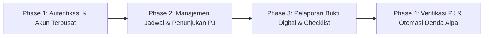
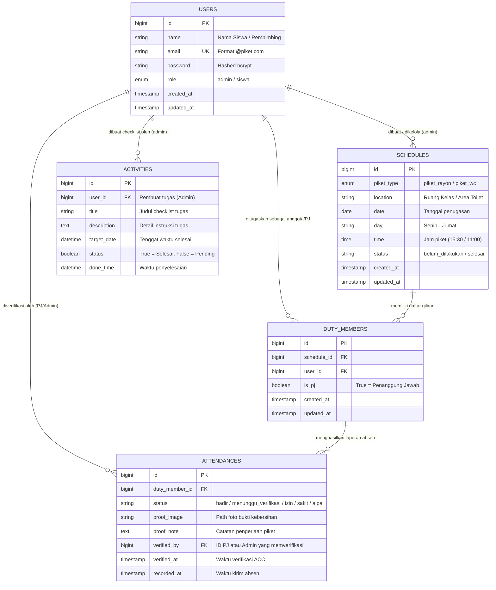
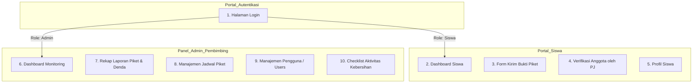

# DOKUMENTASI SISTEM INFORMASI & ABSENSI PIKET DIGITAL
## Rayon Cisarua 5 - SMK Wikrama Bogor (TP 2026/2027)

**Aplikasi:** Sistem Piket Rayon Cisarua 5 (CBT Produktif)  
**Pengembang:** Mochammad Fazriel Muliawan  
**Pembimbing Rayon:** Pembimbing Rayon Cisarua 5  
**Tech Stack:** Laravel 11, Filament v3, Livewire, Tailwind CSS, MySQL  

---

## 1. Highlight & Ringkasan Eksekutif

> [!NOTE]  
> Pembimbing Rayon dan Siswa Rayon Cisarua 5 dapat mengelola dan memantau jadwal piket kelas maupun piket WC secara terstruktur. Siswa dapat mengunggah bukti kebersihan secara digital melalui dokumentasi foto langsung, Penanggung Jawab (PJ) piket dapat memverifikasi kehadiran rekannya secara berjenjang, dan sistem secara otomatis menghitung status Alpa serta akumulasi denda harian bagi siswa yang melanggar.

---

## 2. Background and Problem Statement

Dalam tata tertib pembinaan kesiswaan di lingkungan Rayon Cisarua 5 SMK Wikrama Bogor, piket kebersihan ruang kelas dan area tanggung jawab rayon merupakan rutinitas wajib harian. Namun, pelaksanaan sistem manual konvensional menghadapi berbagai kendala:

1. **Informasi Jadwal Sering Terlewat:** Siswa kerap lupa hari giliran piketnya karena jadwal papan tulis sering terhapus atau tertimpa.
2. **Ketiadaan Validasi Bukti Pekerjaan:** Tidak ada rekam jejak visual objektif mengenai apakah ruangan benar-benar telah disapu, dipel, dan dirapikan sebelum siswa pulang.
3. **Beban Pengawasan Pembimbing Rayon:** Guru/Pembimbing Rayon kesulitan memverifikasi kehadiran satu per satu dari 34 siswa tanpa adanya peran koordinasi dari Penanggung Jawab (PJ).
4. **Ketidakteraturan Rekapitulasi Denda:** Kebijakan denda bagi siswa yang tidak piket (Alpa) sebesar Rp 5.000/hari sulit terpantau secara transparan tanpa pembukuan sistem digital.

### Solusi Sistem
Platform Website Piket Rayon Cisarua 5 ini hadir sebagai solusi digital terintegrasi yang menghadirkan:
* 🔐 **Autentikasi Terpusat:** Akun siswa dan admin dikontrol penuh oleh Pembimbing Rayon tanpa registrasi luar.
* 📅 **Jadwal Otomatis 1 Minggu:** Pemetaan 34 siswa untuk Piket Kelas dan Piket WC (Senin–Jumat).
* 📸 **Pelaporan Bukti Foto:** Siswa wajib mengunggah foto kondisi ruangan setelah dibersihkan.
* 🛡️ **Verifikasi Berjenjang oleh PJ:** Foto bukti diperiksa dan di-ACC langsung oleh PJ piket harian.
* ⚖️ **Vonis Alpa & Denda Otomatis:** Deteksi pergantian hari otomatis menentukan status Alpa bagi siswa yang tidak menuntaskan kewajiban piket.

---

## 3. Objective & Tahapan Rencana Pengembangan

* **Phase 1 (Autentikasi & Otorisasi):**  
  Pengaturan hak akses peran (*Role Permission*): **Admin** (Pembimbing Rayon) dan **Siswa** (Anggota/PJ). Pendaftaran akun dikunci secara terpusat oleh Admin demi keamanan data sekolah.
* **Phase 2 (Manajemen Penjadwalan & Penetapan PJ):**  
  Pengorganisasian 34 siswa Rayon Cisarua 5 ke dalam jadwal harian (Senin–Jumat) dengan penunjukan 1 orang Penanggung Jawab (PJ) per hari dan pembagian area piket (Kelas & WC).
* **Phase 3 (Pelaporan Digital & Dokumentasi Kebersihan):**  
  Fitur dashboard siswa untuk mengunggah foto dokumentasi hasil piket dan checklist tugas (menyapu, mengepel, membersihkan papan tulis, merapikan meja).
* **Phase 4 (Verifikasi Berjenjang & Kalkulasi Konsekuensi):**  
  Sistem validasi laporan oleh PJ piket serta otomasi cerdas yang mengevaluasi status ketidakhadiran (*Alpa - Denda Rp 5.000*) secara otomatis berdasarkan audit tanggal sistem.

---

## 4. Technical Architecture: Entity Relationship Diagram (ERD)

---

## 5. Kamus Data Sistem (Data Dictionary)

| Nama Tabel | Atribut / Field | Tipe Data & Constraint | Keterangan Aturan Bisnis |
| :--- | :--- | :--- | :--- |
| **1. users** | `id` | `BIGINT` (PK, Auto Increment) | Identitas unik pengguna |
| | `name` | `VARCHAR(255)` | Nama lengkap siswa atau pembimbing |
| | `email` | `VARCHAR(255)` (Unique) | Kredensial login akun |
| | `password` | `VARCHAR(255)` | Kata sandi akun (terenkripsi Hash) |
| | `role` | `ENUM('admin', 'siswa')` | Hak akses otorisasi |
| | `created_at` / `updated_at` | `TIMESTAMP` | Waktu pencatatan akun |
| **2. schedules** | `id` | `BIGINT` (PK, Auto Increment) | Identitas unik jadwal |
| | `piket_type` | `ENUM('piket_rayon', 'piket_wc')` | Kategori penugasan kebersihan |
| | `location` | `VARCHAR(255)` | Area lokasi piket |
| | `date` | `DATE` | Tanggal pelaksanaan piket |
| | `day` | `VARCHAR(20)` | Hari pelaksanaan (Senin – Jumat) |
| | `time` | `TIME` | Jadwal mulai (contoh: 15:30:00) |
| | `status` | `VARCHAR(50)` | Status jadwal (`belum_dilakukan`, `selesai`) |
| **3. duty_members** | `id` | `BIGINT` (PK, Auto Increment) | Identitas data anggota piket |
| | `schedule_id` | `BIGINT` (FK -> schedules.id) | Terhubung ke sesi jadwal |
| | `user_id` | `BIGINT` (FK -> users.id) | Terhubung ke akun siswa |
| | `is_pj` | `BOOLEAN` (Default: false) | `true` jika bertugas sebagai PJ |
| **4. attendances** | `id` | `BIGINT` (PK, Auto Increment) | ID entri laporan kehadiran |
| | `duty_member_id` | `BIGINT` (FK -> duty_members.id)| Referensi giliran anggota |
| | `status` | `VARCHAR(50)` | `hadir`, `menunggu_verifikasi`, `izin`, `sakit`, `alpa` |
| | `proof_image` | `VARCHAR(255)` (Nullable) | Filepath foto bukti kebersihan |
| | `proof_note` | `TEXT` (Nullable) | Catatan pekerjaan siswa |
| | `verified_by` | `BIGINT` (FK -> users.id, Nullable) | PJ atau Admin yang memverifikasi |
| | `verified_at` | `TIMESTAMP` (Nullable) | Waktu ACC laporan |
| | `recorded_at` | `TIMESTAMP` | Waktu siswa menekan tombol lapor |
| **5. activities** | `id` | `BIGINT` (PK, Auto Increment) | ID checklist aktivitas |
| | `user_id` | `BIGINT` (FK -> users.id) | Dikelola oleh Admin |
| | `title` | `VARCHAR(255)` | Judul tugas (contoh: Menyapu & Mengepel) |
| | `description` | `TEXT` (Nullable) | Rincian pengerjaan tugas |
| | `target_date` | `DATETIME` | Target jam penyelesaian |
| | `status` | `BOOLEAN` (Default: false) | Checklist status pengerjaan |
| | `done_time` | `DATETIME` (Nullable) | Waktu tugas diselesaikan |

---

## 6. Pembahasan Teknis & Aturan Sistem (Business Rules)

### 1. Logika Vonis Alpa Otomatis
Sistem dilengkapi *dynamic model accessor* pada Model `DutyMember` yang menghitung status kehadiran secara seketika (*real-time*):
* Jika siswa telah diverifikasi hadir -> Status: **Hadir (Terverifikasi)**.
* Jika siswa telah mengunggah bukti namun belum diverifikasi -> Status: **Menunggu Verifikasi PJ**.
* Jika jadwal berada di masa depan (`date > today`) -> Status: **Belum Mulai (Jadwal Mendatang)**.
* Jika jadwal hari ini dan belum lapor (`date == today`) -> Status: **Belum Piket / Absen**.
* Jika tanggal jadwal telah terlewati dan tidak ada riwayat absensi masuk -> Status: **Alpa (Denda Rp 5.000)**.

### 2. Kebijakan Keamanan Autentikasi
* Registrasi publik (`/register`) ditiadakan untuk menjaga integritas keanggotaan rayon.
* Pembuatan dan pengaturan akun siswa sepenuhnya dikelola melalui menu **Users** di Panel Admin Pembimbing Rayon.

---

## 7. Rincian Modul Halaman, User Stories, & Form Validation

### 1. Halaman Login
* **User Story:** Sebagai siswa atau pembimbing rayon, saya ingin login menggunakan email dan password untuk masuk ke portal sistem sesuai peran saya.
* **Data Source:** Tabel `users` (`email`, `password`, `role`).
* **Validasi Form:**
  * `email`: Required, format email valid, terdaftar di sistem.
  * `password`: Required, dicocokkan dengan hash database.

### 2. Dashboard Siswa
* **User Story:** Sebagai siswa, saya ingin melihat giliran jadwal piket saya terdekat, rekan satu regu, siapa penanggung jawab (PJ) hari itu, dan status absensi saya.
* **Data Source:** `schedules`, `duty_members`, `attendances`, `activities`.
* **Validasi:** Halaman informatif analitik.

### 3. Formulir Pelaporan Piket (Siswa)
* **User Story:** Sebagai siswa yang bertugas piket hari ini, saya ingin mengirimkan bukti foto kebersihan kelas/toilet dan catatan pengerjaan agar kehadiran saya tercatat.
* **Data Source:** Tabel `attendances`.
* **Validasi Form:**
  * `proof_image`: Required, format gambar (JPG/PNG/JPEG), ukuran maksimal 5 MB.
  * `proof_note`: Optional, uraian teks pekerjaan kebersihan yang diselesaikan.

### 4. Panel Verifikasi PJ (Khusus Penanggung Jawab)
* **User Story:** Sebagai PJ piket hari ini, saya ingin melihat dan memvalidasi (*Approve / Reject*) foto bukti pekerjaan rekan regu saya agar mereka mendapatkan status hadir.
* **Data Source:** Tabel `attendances` (`verified_by`, `verified_at`, `status`).
* **Validasi Form:** Aksi tombol satu klik (*Verifikasi Kehadiran*).

### 5. Profil Pengguna
* **User Story:** Sebagai pengguna, saya ingin memperbarui data diri dan mengubah kata sandi default saya demi keamanan akun.
* **Data Source:** Tabel `users`.
* **Validasi Form:**
  * `password`: Min 8 karakter, konfirmasi kecocokan kata sandi.

### 6. Panel Admin: Laporan Piket & Rekapitulasi Denda
* **User Story:** Sebagai Pembimbing Rayon, saya ingin melihat status kehadiran seluruh siswa (Hadir, Menunggu, Alpa) beserta kalkulasi denda Rp 5.000 secara otomatis.
* **Data Source:** `duty_members`, `attendances`, `schedules`, `users`.
* **Fitur:** Pencarian siswa, filter hari, aksi hapus satuan dan *bulk delete*.

### 7. Panel Admin: Manajemen Jadwal (Schedules)
* **User Story:** Sebagai Pembimbing Rayon, saya ingin mengatur tanggal, hari, tipe piket (Rayon / WC), lokasi, serta menugaskan siswa dan menunjuk PJ.
* **Data Source:** Tabel `schedules` dan `duty_members`.
* **Validasi Form:**
  * `day`: Required (Senin – Jumat).
  * `location`: Required (Nama ruang kelas / area WC).
  * `date`: Required (Format tanggal valid).

### 8. Panel Admin: Manajemen Akun Siswa (Users)
* **User Story:** Sebagai Pembimbing Rayon, saya ingin membuat akun untuk 34 siswa, mereset password, dan menata data kontak rayon.
* **Data Source:** Tabel `users`.
* **Validasi Form:**
  * `name`: Required.
  * `email`: Required, unique format email.
  * `role`: Required (`admin` / `siswa`).

### 9. Panel Admin: Checklist Aktivitas Kebersihan
* **User Story:** Sebagai Pembimbing Rayon, saya ingin mendata daftar rincian tugas kebersihan (Menyapu, Mengepel, Membersihkan Kaca) agar memiliki target jam kerja yang jelas.
* **Data Source:** Tabel `activities`.
* **Validasi Form:**
  * `title`: Required, maksimal 255 karakter.
  * `target_date`: Required, waktu pelaksanaan tugas.
